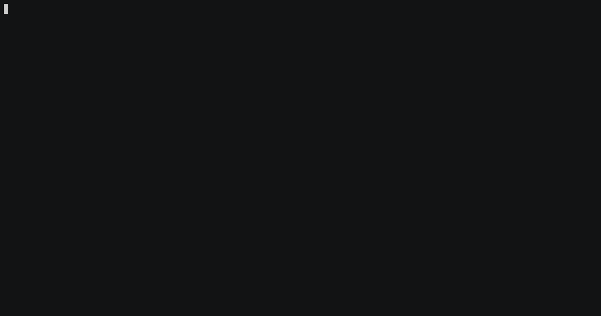

# NVIDIA SASS Assembly Lessons

Learn GPU assembly through interactive tutorials and hands-on exploration of NVIDIA SASS code.



## Quick Start

```bash
# Setup
git clone https://github.com/yuninxia/nvidia-sass-lessons.git
cd nvidia-sass-lessons
python3.11 -m venv .venv
source .venv/bin/activate
pip install -e .

# Start learning
sass-dissect                      # Interactive menu
sass-dissect --lesson 1 tutorial  # Start lesson 1
```

## What You'll Learn

| # | Topic | Key Concepts |
|---|-------|-------------|
| 01 | **Vector Addition** | Basic GPU ops, memory load/store |
| 02 | **Memory Patterns** | Coalesced vs strided access |
| 03 | **Shared Memory** | Tiling, barriers, LDS/STS |
| 04 | **Predication** | Conditional execution without branching |
| 05 | **Control Flow** | Loops, branches, divergence |
| 06 | **Warp Shuffles** | Register data exchange |
| 07 | **Atomics** | Global atomic operations |
| 08 | **Barriers** | Block synchronization |
| 09 | **Special Registers** | Thread/block IDs, lane IDs |

## Three Ways to Learn

### 1. Interactive Tutorial
```bash
sass-dissect --lesson 1 tutorial            # Step-by-step concepts
```
Press ENTER to advance. Learn GPU basics before diving into code.

### 2. SASS Explorer
```bash
sass-dissect --lesson 1 explore             # Unoptimized code
sass-dissect --lesson 1 explore --optimized # Optimized code
```
Browse real SASS assembly with line-by-line explanations.

### 3. Build & Analyze
```bash
sass-dissect build                          # Compile to SASS
cat disasm/lesson_01.sm_80.O0.sass        # View raw output
diff disasm/lesson_01.sm_80.O0.sass \     # Compare optimization
     disasm/lesson_01.sm_80.O3.sass
```

## Commands

| Command | Description |
|---------|------------|
| `sass-dissect` | Interactive menu |
| `sass-dissect list` | Show all lessons |
| `sass-dissect build` | Build SASS files |
| `sass-dissect --lesson N tutorial` | Start tutorial for lesson N |
| `sass-dissect --lesson N explore` | Explore SASS for lesson N |

## GPU Architecture Support

```bash
SASS_ARCH=sm_75 sass-dissect build  # Turing (RTX 20xx)
SASS_ARCH=sm_80 sass-dissect build  # Ampere (RTX 30xx, A100) [default]
SASS_ARCH=sm_89 sass-dissect build  # Ada (RTX 40xx)
SASS_ARCH=sm_90 sass-dissect build  # Hopper (H100)
```

## Example Learning Flow

```bash
# 1. Learn concepts
sass-dissect --lesson 1 tutorial

# 2. See real code
sass-dissect --lesson 1 explore

# 3. Compare optimization
sass-dissect --lesson 1 explore --optimized

# 4. Experiment
vim lesson_01/kernel.cu
sass-dissect build
sass-dissect --lesson 1 explore  # See your changes
```

## Requirements

- **Option 1**: CUDA Toolkit 12.x+ (for local builds)
- **Option 2**: Docker (no CUDA needed)
  ```bash
  bash scripts/docker-build.sh
  ```
- **Python**: 3.8+ (3.11 recommended)

## Key Features

- **Interactive Learning** - Press ENTER to advance, no info overload
- **Real SASS Code** - See actual GPU assembly, not just theory
- **Optimization Comparison** - Understand compiler optimizations
- **Multiple GPU Archs** - Support from Turing to Hopper
- **Extensible** - Add your own lessons easily

## Resources

See [docs/links.md](docs/links.md) for useful tools and documentation.

---

**Ready to understand how GPUs really work?** Start with: `sass-dissect --lesson 1 tutorial`
